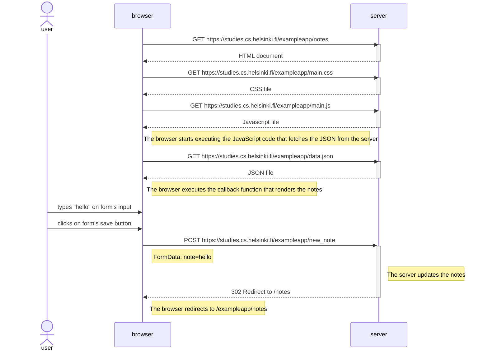

```mermaid
sequenceDiagram
    actor user
    participant browser
    participant server

    browser->>server: GET https://studies.cs.helsinki.fi/exampleapp/notes
    activate server
    server-->>browser: HTML document
    deactivate server

    browser->>server: GET https://studies.cs.helsinki.fi/exampleapp/main.css
    activate server
    server-->>browser: CSS file
    deactivate server

    browser->>server: GET https://studies.cs.helsinki.fi/exampleapp/main.js
    activate server
    server-->>browser: Javascript file
    deactivate server

    Note right of browser: The browser starts executing the JavaScript code that fetches the JSON from the server

    browser->>server: GET https://studies.cs.helsinki.fi/exampleapp/data.json
    activate server
    server-->>browser: JSON file
    deactivate server

    Note right of browser: The browser executes the callback function that renders the notes

    user->>browser: types "hello" on form's input
    user->>browser: clicks on form's save button 
    browser->>+server: POST https://studies.cs.helsinki.fi/exampleapp/new_note
    Note right of browser: FormData: note=hello
    Note right of server: The server updates the notes
    server-->>-browser: 302 Redirect to /notes

    Note right of browser: The browser redirects to /exampleapp/notes
```